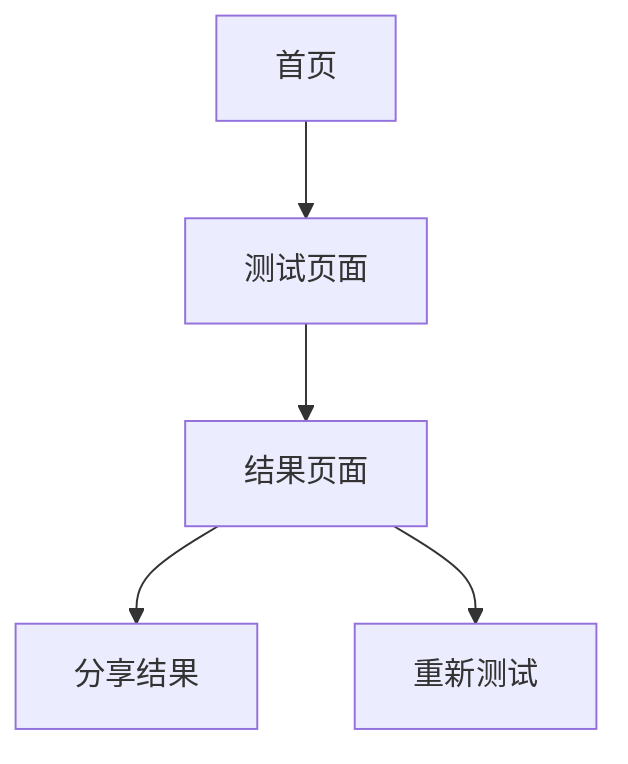

## 1. 产品概述
灵魂匹配测试是一个基于5个维度、30道题目的性格匹配评估工具。用户通过5级量表回答问题，系统将其答案与创建者预设的档案进行对比分析，最终给出5种匹配结果分类。

该产品帮助用户快速了解与他人的性格契合度，适用于社交破冰、团队建设等场景。

## 2. 核心功能

### 2.1 用户角色
| 角色 | 注册方式 | 核心权限 |
|------|----------|----------|
| 测试创建者 | 无需注册 | 创建测试、设置个人档案、生成分享链接 |
| 测试参与者 | 无需注册 | 参与测试、查看匹配结果 |

### 2.2 功能模块
灵魂匹配测试包含以下核心页面：
1. **首页**：测试介绍、开始测试按钮、创建者信息展示
2. **测试页面**：30道题目展示、5级量表选择、进度显示
3. **结果页面**：匹配分数展示、5种结果分类、详细分析、重新测试

### 2.3 页面详情
| 页面名称 | 模块名称 | 功能描述 |
|----------|----------|----------|
| 首页 | Hero区域 | 展示测试标题、简介、开始测试按钮 |
| 首页 | 创建者信息 | 显示测试创建者的基本信息和档案预览 |
| 测试页面 | 题目展示 | 逐题显示30道问题，支持前后翻页 |
| 测试页面 | 量表选择 | 5级李克特量表（非常不同意到非常同意） |
| 测试页面 | 进度指示 | 显示当前题目序号和总体进度 |
| 结果页面 | 匹配分数 | 显示0-100分的匹配度评分 |
| 结果页面 | 结果分类 | 展示5种匹配等级（如：灵魂伴侣、高度契合等） |
| 结果页面 | 详细分析 | 展示5个维度的详细对比分析 |
| 结果页面 | 分享功能 | 生成可分享的测试结果链接 |

## 3. 核心流程
用户操作流程：
1. 创建者设置个人档案并生成测试链接
2. 参与者通过链接进入测试
3. 参与者完成30道题目
4. 系统计算匹配度并展示结果
5. 参与者可分享结果或重新测试

## 4. 用户界面设计

### 4.1 设计风格
- 主色调：深紫色（#6B46C1）到粉色的渐变
- 辅助色：白色背景，深灰色文字
- 按钮样式：圆角矩形，渐变背景
- 字体：系统默认字体，标题18-24px，正文14-16px
- 布局风格：卡片式布局，居中显示
- 图标风格：简约线性图标

### 4.2 页面设计概览
| 页面名称 | 模块名称 | UI元素 |
|----------|----------|--------|
| 首页 | Hero区域 | 渐变背景、大标题、简介文字、醒目的开始按钮 |
| 测试页面 | 题目卡片 | 白色卡片、题目文字居中、5个圆形选择按钮 |
| 测试页面 | 进度条 | 顶部进度条显示当前进度 |
| 结果页面 | 分数展示 | 大字体显示匹配分数、圆形进度条 |
| 结果页面 | 结果分类 | 彩色标签显示匹配等级 |
| 结果页面 | 详细分析 | 5个维度的雷达图对比展示 |

### 4.3 响应式设计
采用桌面端优先设计，适配移动端显示。主要考虑触摸交互优化，确保按钮大小适合点击。