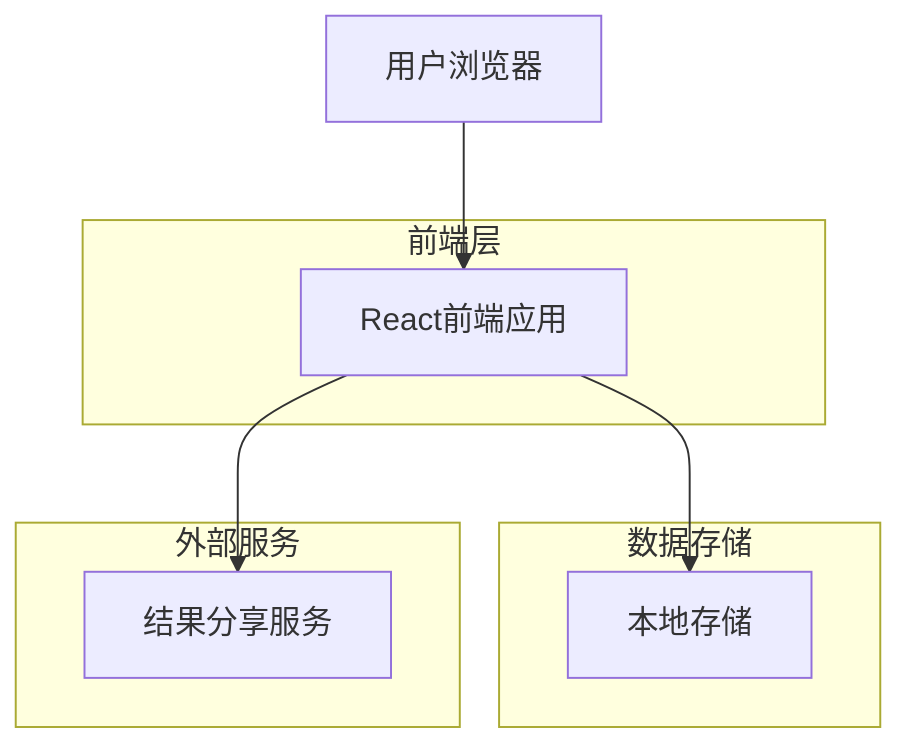
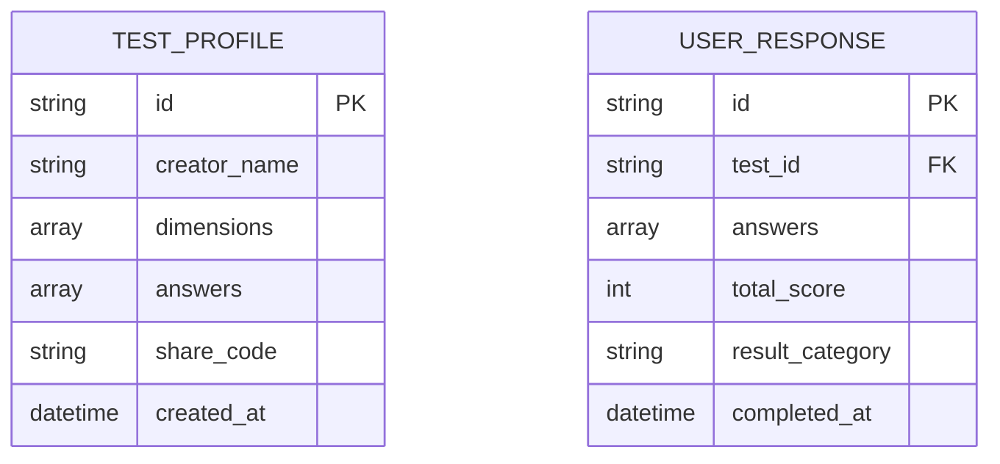

## 1. 架构设计



## 2. 技术描述

- 前端：React@18 + Vite
- 样式：Tailwind CSS@3
- 状态管理：React Hooks + Context
- 数据存储：浏览器本地存储（LocalStorage）
- 部署：静态网站托管（Vercel/Netlify）
- 初始化工具：vite-init

## 3. 路由定义

| 路由 | 用途 |
|------|------|
| / | 首页，展示测试介绍和开始按钮 |
| /test | 测试页面，显示题目和答题界面 |
| /result | 结果页面，显示匹配结果和分析 |
| /create | 创建页面，设置个人档案（可选） |

## 4. 数据模型

### 4.1 数据结构



### 4.2 数据定义

测试档案表（test_profiles）
```javascript
// 本地存储结构
{
  id: "unique-id",
  creatorName: "创建者姓名",
  dimensions: [
    "开放性", "尽责性", "外向性", "宜人性", "神经质"
  ],
  answers: [1, 3, 5, 2, 4, ...], // 30个答案
  shareCode: "abc123",
  createdAt: "2026-04-17T00:00:00Z"
}
```

用户回答表（user_responses）
```javascript
// 本地存储结构
{
  id: "response-id",
  testId: "test-profile-id",
  answers: [2, 4, 1, 5, 3, ...], // 30个答案
  totalScore: 78,
  resultCategory: "高度契合",
  completedAt: "2026-04-17T00:30:00Z"
}
```

## 5. 部署方案

### 5.1 静态部署
由于这是一个纯前端应用，可以通过以下方式部署：

1. **Vercel**（推荐）
   - 免费托管静态网站
   - 自动HTTPS和自定义域名
   - 全球CDN加速

2. **Netlify**
   - 拖拽部署，简单易用
   - 支持自定义域名
   - 免费SSL证书

3. **GitHub Pages**
   - 完全免费
   - 与GitHub仓库集成
   - 适合开源项目

### 5.2 部署步骤
1. 构建项目：`npm run build`
2. 上传dist文件夹到托管平台
3. 获取分享链接
4. 配置自定义域名（可选）

### 5.3 分享链接生成
- 每个测试档案生成唯一的6位分享码
- 链接格式：`https://your-domain.com/test/{shareCode}`
- 结果页面链接：`https://your-domain.com/result/{responseId}`

## 6. 性能优化

- 使用React.lazy进行代码分割
- 图片和资源压缩
- 启用Gzip压缩
- 使用CDN加速静态资源
- 浏览器缓存策略